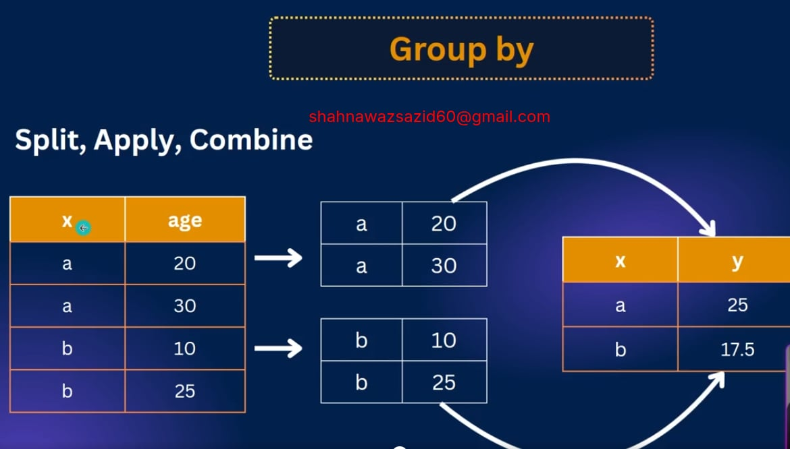

# Postgres-Data-Handling-and-Aggregation-Essentials

Practice Task: https://spangle-heron-ba0.notion.site/Practice-SQL-Queries-264963b8606180b6b598f99680a378b8
My Notion : https://www.notion.so/Practice-SQL-Queries-2641351446ad807882fdc9be365df9d9?source=copy_link


In this module, you’ll learn essential data manipulation concepts in PostgreSQL. From handling NULL values with COALESCE to implementing LIMIT and OFFSET for pagination, updating and deleting records, everything is covered. You’ll also explore how to group data with GROUP BY and refine results using HAVING for deeper analysis.

## 46-1 Handling NULL with COALESCE
- If we consider a switch either the switch can be off, on or either the switch do not exist. 

### IS METHOD FOR NULL VALUE 
- There is one saying whatever we do with postgres it will give null 

```sql
select null = null
```
- it will give null 

```sql 
select null <> null 
```
- This is also null 

- Make a query that will give us the students whose email is not null... 


```sql
select * from students where email = null 
```

```sql 
select * from students where email <> null 
```
- this is wrong this will give nothing because null gives null 

- we have to use `is` method 

```sql 
select * from students where email is null;
```
```sql 
select * from students where email is not null;
```

### COALESCE FOR NULL VALUE 

```SQL 
select coalesce(null,null,2,3)
```
- This does something it skips null and when ever it gets value it will show the value and will not go further. like it will show result 2. where it is needed? 
- when we design a database it goes from backend to frontend. if any null value goes to frontend, application will crash. 

- lets see practical example of `coalesce`

```sql
select coalesce(email, 'Not Provided') as email, * from students;
```
- it will give the email field where the email field it will give us `Not Provided`

## 46-2 LIMIT, OFFSET & Pagination
### Limit 
```sql 
select * from students limit 5;
```
- it will show 5 data by limiting among all. 

```sql
select * from students 
where country IN ('Bangladesh','USA','Spain') limit 1;

```

### OFFSET 

```sql
select * from students  limit 3 offset 2;
```
- It will skip first 2 data and send 


### Lets do the pagination using Limit and Offset 

```sql 
select * from students  limit 3 offset 2 * 0; -- first page
select * from students  limit 3 offset 2 * 1; -- second page 
select * from students  limit 3 offset 2 * 2; -- Third page
select * from students  limit 3 offset 2 * 3; -- fourth page 
```

## 46-3 Updating Data

- suppose 31 no user has null email. lets update the email where the email is null 

```sql 
update students set email = 'default@gmail.com' where email is null
```
- multiple field update of a single row 

```sql 
update students 
  set first_name = 'Dustbin', age = 100
  where student_id = 1;
```

```sql 
update students 
  set grade ='D'
  where student_id = 1 or student_id = 2;
```
- same thing in different method 

```sql 
update students 
  set grade ='F'
  where student_id in (1,2);
```

## 46-4 Deleting Data

```sql 
delete from students; 
```
- this will delete all the data of the table. 


```sql 
delete from students where grade = 'F'; 
```
- who have got F will be removed 

```sql 
delete from students where age > 20 and grade = 'F'; 
```

## 46-5 GROUP BY Explained

```sql
select country from students group by country;
```


- group by split then combine and then join; 

- if we want to grab avg age 

```sql 
select country, avg(age) from students group by country;
```
- count students by country 

```sql 
select country, count(*) from students group by country;
```

- count students by grade 

```sql 
select grade, count(*) from students group by grade;
```

## 46-6 GROUP BY with HAVING
- Courses with more than 1 students 

```sql 
select course, count(*) from students group by course having count(*) >1;
```
- its like where but not exactly same. where runs over entire table rows but having runs over the grouped rows only. 

- lets find countries where average age opf students is greater than 21 

```sql
select country, avg(age) from students group by country having avg(age) > 21;
```